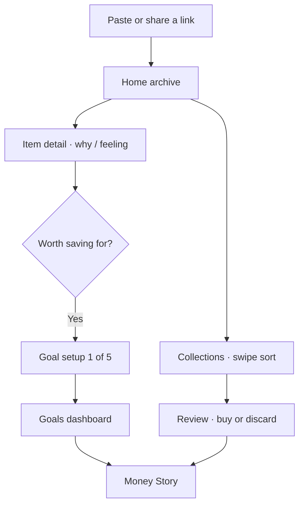

# Prism Product Vision — Recreation IA (v2)

Date: 2026-09-19  
Status: Active product direction (source of truth: `Prism App Screens Recreation/`)

## Positioning

**Prism is an intentional-spending assistant that turns social-media inspiration into clear priorities, achievable goals, and better spending decisions.**

Consumer lines:

- Turn impulse into inspiration.
- Save what inspires you. Work toward what matters.

Core loop:

> **Save → Sort into collections → Reflect → Review (buy or let go) → Set a goal → Make progress → Learn (Money Story)**

Prism never connects banks, calculates affordability from income, or dictates choices. Users declare targets, contributions, and priorities. Prism surfaces pace, trade-offs, and patterns.

## Information architecture

**Tab bar (4):** Home · Collections · Goals · Money Story

| Surface | Role |
| --- | --- |
| **Home** | Archive of everything saved — search, filters, masonry cards |
| **Collections** | Group and sort saves; swipe keep/delete into a collection |
| **Goals** | Primary + other goals; setup and progress live here |
| **Money Story** | Weekly / Monthly / Over time narrative of decisions vs goals |
| **Review** | Flow (not a tab) — Buy Options + Discarded for a collection, reached after sorting |
| **Settings** | Off-tab, opened from the Home profile control |
| **Paste anything** | Capture sheet (share extension or +) — link preview stages |

## Conceptual model

| Concept | Meaning | Example |
| --- | --- | --- |
| Aspiration / Save | Something that caught my attention | A reel about convertible sandals |
| Collection | A place to group and sort saves | Summer Fashion |
| Goal | Something I’ve decided to work toward | New laptop by March 2027 |
| Plan | Contribution, milestones, buffer, non-money progress | $191 / month |
| Contribution | Money or progress added toward a goal | $60 this week |
| Outcome | What ultimately happened | Completed, paused, abandoned |

Saves remain aspirations until the user starts a goal (“Worth saving for?”).

## User journey

## Goal types (MVP support)

- Purchase / Tech one-time
- Experience / Event
- Travel / Trip
- Project
- Recurring
- Low / no-cost

## Goal priority states

| State | Limit |
| --- | ---: |
| Primary | 1 |
| Active | Up to 3 |
| Flexible | Unlimited, not actively funded |
| Someday | Unlimited |

## Goal setup (5 steps)

1. Define the goal (name, type, cost, where, date — chips from the save)
2. Why this matters (motivation list)
3. Set the target (amount, frequency, buffer, pace preview)
4. Where it ranks (priority + allocation preview)
5. Your plan (contribution, milestones, buffer, non-money progress)

## Home

Masonry of saves with search and chips: **All · High priority · Undecided · Videos**.  
Meta row: save count + “newest first”. Profile opens Settings. Plus / share opens Paste anything.

## Collections + Review

- Swipe deck: right = keep in collection, left = delete.
- After sorting: **Review** shows Buy Options and Discarded rows for that collection.

## Item detail

Portrait media, Bought?, **AI DESCRIPTION** (local mock for MVP), editable tags, “Why do I want this?”, feeling stars, Delete / Save.  
Optional **Worth saving for?** carry-over into goal setup.

## Money Story

Segmented **Weekly / Monthly / Over time** narrative: headline, metrics, goal progress, attention vs intention, influence by source, how you decided, feelings, trade-offs, next-step CTA.  
Confirmed vs estimated remain labeled; let-go estimates are never “money saved.”

## Financial boundary (unchanged)

- No bank links
- No affordability engine
- Confirmed vs estimated remain labeled
- Let-go estimates are never “money saved”
- Spending pocket remains an optional comfort guardrail alongside goals

## AI description

**MVP:** local mock copy derived from title, domain, and notes (no network).  
**Future:** real generation from link / media.

## Deferred / Future

- Real AI description generation
- Multi-goal monthly allocation editor (read-only preview ships in setup)
- Cloud sync of goals
- Missing recreation screen 06 (none in folder)
