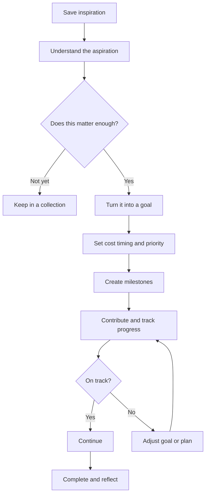

# Prism Product Vision — Goals Era (v1)

Date: 2026-09-19  
Status: Active product direction (supersedes impulse-only framing)

## Positioning

**Prism is an intentional-spending assistant that turns social-media inspiration into clear priorities, achievable goals, and better spending decisions.**

Consumer lines:

- Save what inspires you. Work toward what matters.
- From “I want this” to “I’m making it happen.”

Core loop:

> **Save → Reflect → Prioritize → Set a goal → Make progress → Decide intentionally → Learn**

Prism still never connects banks, calculates affordability from income, or dictates choices. Users declare targets, contributions, and priorities. Prism surfaces pace, trade-offs, and patterns.

## Conceptual model

| Concept | Meaning | Example |
| --- | --- | --- |
| Aspiration | Something that caught my attention | A TikTok about Japan |
| Goal | Something I’ve decided to work toward | Visit Japan in April 2027 |
| Plan | Components required to achieve it | Flights, hotels, food, activities |
| Contribution | Money or progress added toward it | $250 saved this month / Chose dates |
| Outcome | What ultimately happened | Completed, changed, paused, abandoned |

Saved items remain **aspirations** until the user taps **Make this a goal**.

## User journey

## Goal types (MVP support)

- Purchase
- Experience
- Travel
- Project
- Recurring (frequency progress)
- Low / no-cost (milestone progress without money)

## Goal priority states

| State | Limit |
| --- | ---: |
| Primary | 1 |
| Active | Up to 3 |
| Flexible | Unlimited, not actively funded |
| Someday | Unlimited |

## Goal setup (required fields)

1. What do you want to achieve?
2. How much will it cost? (optional for low/no-cost)
3. When do you want it?
4. How much have you already saved / progressed?
5. How important is it vs other goals?
6. Why does this matter? (motivation)

Prism computes remaining + required contribution pace from user-entered numbers only.

## Home

Lead with the **primary goal** card (progress, remaining, pace, status, Add progress).  
Secondary: active goals.  
Below: aspiration feed (existing saves masonry).

## Goal-aware decisions

When reviewing a purchase aspiration, show trade-offs against the primary goal / monthly contribution — expose consequence, never dictate.

## Money Story

Explain whether everyday choices reflect declared priorities (contributions, redirected estimates with disclaimer, planning milestones, aspiration vs funding patterns).

## Financial boundary (unchanged)

- No bank links
- No affordability engine
- Confirmed vs estimated remain labeled
- Let-go estimates are never “money saved”
- Spending pocket remains an optional comfort guardrail alongside goals

## Implementation slices (this update)

1. Domain + SwiftData for Goal / Milestone / Component / Contribution / aspiration link
2. Make this a goal setup flow
3. Home goal dashboard + Add progress
4. Goal-aware review copy
5. Money Story goal insights + docs

### Deferred

- Multi-goal monthly allocation editor (show read-only totals first)
- Automatic plan cost recompute from linked saves (“$4,860 plan”)
- Full component booking deadlines
- Cloud sync of goals
